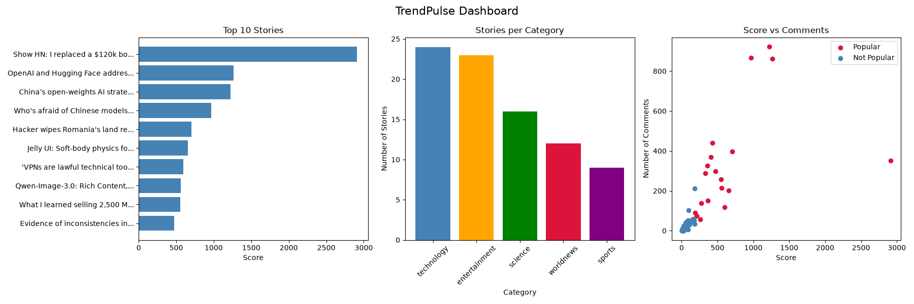

# TrendPulse — What's Actually Trending Right Now

A 4-stage data pipeline that pulls live stories from the HackerNews API, cleans the data, analyses it, and turns it into charts.

```
Task 1              Task 2              Task 3              Task 4
Fetch JSON    →      Clean CSV     →     Analyse       →     Visualise
(HN API)             (Pandas)            (Pandas/NumPy)      (Matplotlib)
```

## What it does

1. **`task1_data_collection.py`** — Fetches trending stories from the [HackerNews API](https://github.com/HackerNews/API), sorts them into 5 categories (technology, worldnews, sports, science, entertainment) based on keyword matching, and saves the raw data as JSON.
2. **`task2_data_processing.py`** — Loads the raw JSON into a Pandas DataFrame, removes duplicates and incomplete rows, fixes data types, filters out low-score stories, and saves a clean CSV.
3. **`task3_analysis.py`** — Runs NumPy-based statistics (mean, median, std deviation) on story scores, finds the most active category and most-discussed story, and adds two derived columns: `engagement` (comments per upvote) and `is_popular` (above-average score).
4. **`task4_visualization.py`** — Builds 3 Matplotlib charts (top stories, category breakdown, score vs. comments) plus a combined dashboard, saved as PNGs.

## Sample output



## How to run it

Each stage feeds the next, so run them in order:

```bash
pip install -r requirements.txt

python task1_data_collection.py     # → data/trends_YYYYMMDD.json
python task2_data_processing.py     # → data/trends_clean.csv
python task3_analysis.py            # → data/trends_analysed.csv
python task4_visualization.py       # → outputs/*.png
```

## Tech stack

- **requests** — API calls to HackerNews
- **pandas** — data cleaning and analysis
- **numpy** — statistical calculations
- **matplotlib** — charts and dashboard

## Project structure

```
trendpulse_rajulaanusree/
├── task1_data_collection.py
├── task2_data_processing.py
├── task3_analysis.py
├── task4_visualization.py
├── requirements.txt
├── data/              (generated, gitignored)
└── outputs/           (generated charts)
```

## Notes

- `data/` is excluded from version control since it's generated output, not source code.
- The HackerNews API is free and requires no authentication.
- Category assignment is based on simple keyword matching against story titles — not perfect, but good enough to spot broad trends.